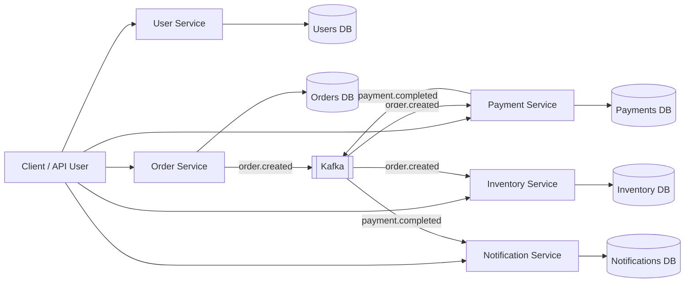

# Order System

A small event-driven order system built with Go, PostgreSQL, Kafka, Docker, and a handful of focused services. It is not trying to be a giant enterprise platform; it is a clean playground for the usual commerce flow: users sign in, products live in inventory, orders are created, payments are processed, and notifications are recorded.

## What Is Inside

The project is split into five services:

| Service | Port | Database | What it does |
| --- | ---: | --- | --- |
| User service | `8085` | `users` | Registration, login, JWT-based identity |
| Order service | `8080` | `orders` | Creates and manages orders, publishes order events |
| Payment service | `8081` | `payments` | Processes payments, publishes payment events |
| Notification service | `8082` -> internal `8083` | `notifications` | Stores notifications after payments complete |
| Inventory service | `8084` | `inventory` | Stores products and reduces stock after orders |

The React client lives in a separate root-level `frontend/` package. It is a client for the whole system, so it should sit next to the services instead of inside any one service folder.





## Tech Stack

- Go `1.25.3`
- PostgreSQL `17-alpine`
- Kafka via `confluentinc/cp-kafka`
- Chi router
- Sarama Kafka client
- JWT auth
- Swagger docs for order and payment services
- Docker Compose for local development

## Project Structure

```text
.
├── docker-compose.yml
├── user-service/
├── order-service/
├── payment-service/
├── inventory-service/
├── notification-service/
└── frontend/              # React + Vite client
```

Each service follows roughly the same shape:

```text
├── cmd/                  # service entrypoint
├── internal/
│   ├── api/              # HTTP handlers and responses
│   ├── config/           # database config
│   ├── db/               # database connection
│   ├── middleware/       # JWT middleware
│   ├── model/            # domain models
│   ├── repository/       # PostgreSQL access
│   └── service/          # business logic
└── migrations/           # SQL schema loaded by Docker Compose
```

Some services also have `internal/kafka/` for producers or consumers.

## Frontend

Start the backend stack, then run the React client:

```sh
cd frontend
npm install
npm run dev
```

The frontend is available at `http://localhost:5173`. During development, Vite proxies `/api/*` requests to the appropriate Go service.

## Architecture

This system uses a service-per-domain approach. Each service owns its own API layer, business logic, repository layer, database connection, models, and SQL migration. The services do not share one database; each one has a dedicated PostgreSQL database, which keeps responsibilities clear and avoids accidental coupling.

The user service is the entry point for identity. It creates users, checks credentials, hashes passwords, and issues JWT tokens. Other services read those tokens through their auth middleware and use the embedded `user_id` and `role` claims to decide what the caller is allowed to do.

The order service owns the order lifecycle. When an order is created, it stores the order and publishes an `order.created` event to Kafka. This lets the rest of the system react without the order service needing to call them directly.

The payment service listens for `order.created`, processes a payment, stores it, and then publishes `payment.completed`. It can also manage payments through its own HTTP handlers, but in the main flow it behaves as an event-driven consumer and producer.

The inventory service also listens for `order.created`. Its job is to reduce product stock based on the items in the order. Product data stays inside the inventory database, so stock changes remain isolated from the order database.

The notification service listens for `payment.completed`. When a payment is completed, it creates a notification record for the related user and order. This keeps notification behavior outside the payment service while still letting it react immediately to payment events.

## Data Ownership

| Service | Owns |
| --- | --- |
| User service | users, roles, password hashes, JWT generation |
| Order service | orders and order items |
| Payment service | payment records and payment status |
| Inventory service | products, prices, and stock quantities |
| Notification service | notification records and notification status |

## Communication Style

The system uses two communication styles:

- HTTP for direct client-to-service requests.
- Kafka for service-to-service events.

Kafka topics currently used:

| Topic | Produced by | Consumed by |
| --- | --- | --- |
| `order.created` | order-service | payment-service, inventory-service |
| `payment.completed` | payment-service | notification-service |

This makes the core flow asynchronous. The order service does not wait for payment, inventory, and notification work to happen inside one large request. It publishes the event, and the interested services continue the workflow.

## Notes

- Admin-only actions depend on the `role` claim inside the JWT.
- User-owned reads are scoped by `user_id` unless the user is an admin.
- Order and payment services include generated Swagger files under `docs/`.
- Kafka topic names are currently hardcoded as `order.created` and `payment.completed`.
- This project is easiest to explore by creating an admin user, adding a product, creating a normal user, then placing an order with that user.
